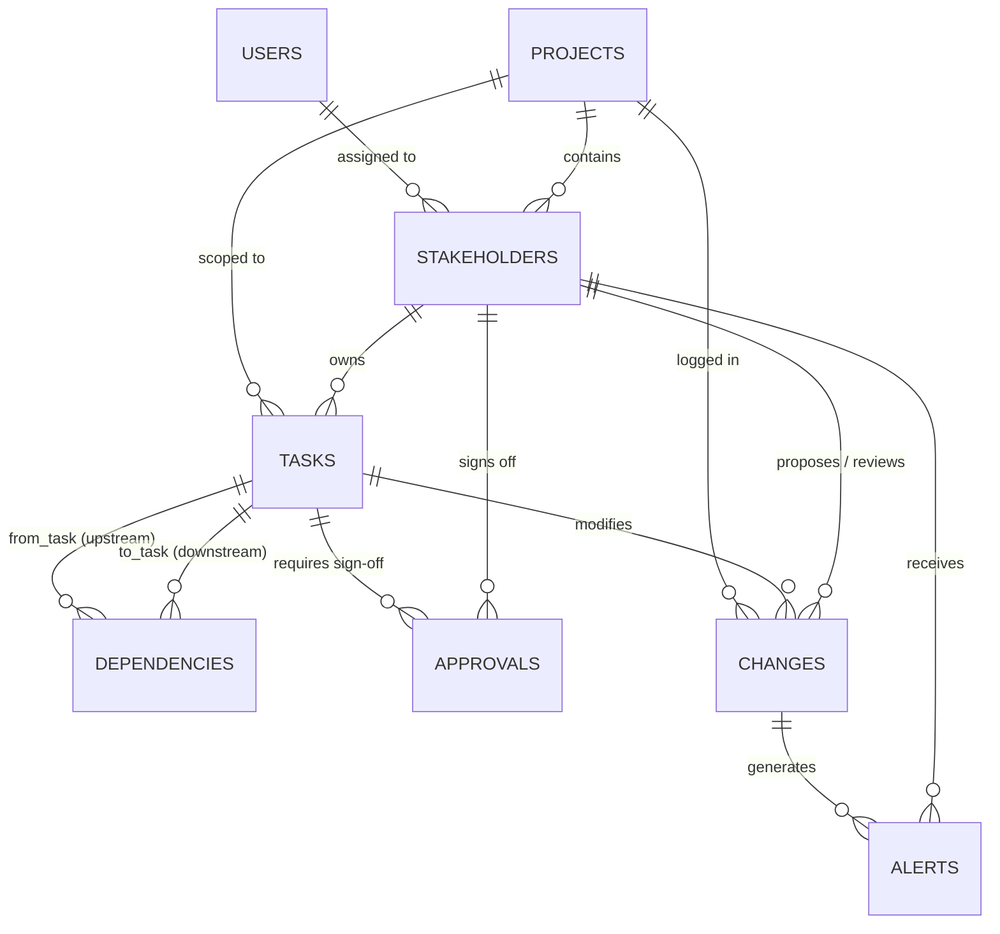
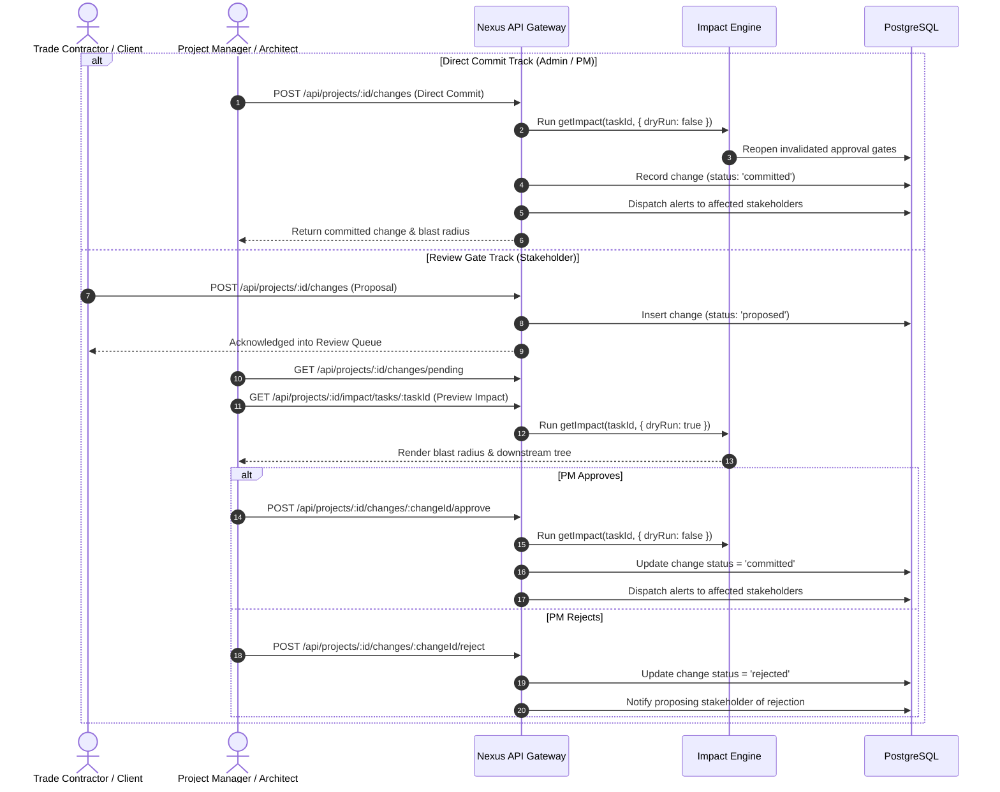

# Nexus — Coordination Intelligence System
### Technical Architecture, Engine Specifications & Comprehensive Documentation

---

## 1. Executive Overview & Problem Statement

### The Problem
On multi-stakeholder interior design and construction projects—spanning architects, general contractors, specialized subcontractors (electrical, plumbing, HVAC, millwork), vendors, and client sponsors—a single modification to one task routinely triggers silent cascading disruptions across dependent trades. 

In traditional project management:
1. **Coordination is Manual**: When a material arrives late or a layout is revised, project managers must manually trace which downstream tasks, contractors, and approvals are affected.
2. **Cascades are Silent**: Subcontractors begin fabrication or installation on outdated assumptions, resulting in expensive demolition, rework, and compounding schedule delays.
3. **Approvals are Invalidate-Blind**: Pre-approved architectural sign-offs are silently undermined by upstream changes without anyone realizing the sign-off is no longer valid.
4. **Accountability is Opaque**: Dispute resolution relies on fragmented text threads, disparate email chains, and conflicting memories.

### The Solution: Nexus
**Nexus** turns project coordination into a **computable, automated dependency intelligence engine**. By modeling deliverables as a directed acyclic graph (DAG), Nexus automatically evaluates graph reachability, calculates blast radius severity, reopens invalidated milestone approvals, notifies affected parties, and records an immutable audit ledger of all decisions.

---

## 2. System Architecture

Nexus is engineered as a decoupled, full-stack client-server platform with stateless API gateways and PostgreSQL ACID transactional guarantees.

```mermaid
flowchart TD
    subgraph Client["Client Tier (React 18 + Vite 5)"]
        UI["Obsidian & Warm Amber Design System"]
        AuthContext["AuthContext (JWT Session & RBAC)"]
        Router["React Router v6 + Route Guards"]
        Views["Status Board | Impact Tree | Project Memory | Alerts"]
    end

    subgraph API["API Tier (Node.js + Express)"]
        AuthMiddleware["JWT Verification & Security Headers (Helmet, CORS)"]
        RBAC["Hierarchical RBAC (Admin, PM, Stakeholder)"]
        
        subgraph Engine["Coordination Intelligence Engine"]
            BFS["BFS Graph Traversal Engine"]
            Cycle["Cycle Detection & Edge Validation"]
            BlastRadius["Blast Radius Scoring & Risk Rating"]
            Bottleneck["Critical Path Owner Reach Analyzer"]
        end
        
        Routes["REST Endpoints (/auth, /projects, /tasks, /changes, /impact, /alerts)"]
    end

    subgraph Database["Database Tier (PostgreSQL on Neon)"]
        Tables[("8 Relational Tables (UUID Primary Keys)
        users · projects · stakeholders · tasks
        dependencies · approvals · changes · alerts")]
        Transactions["ACID Transactions (BEGIN / COMMIT / ROLLBACK)"]
    end

    Client <-->|REST API + Bearer JWT| API
    API <-->|node-postgres (pg pool)| Database
```

### Architectural Principles
* **Stateless API Layer**: All authorization state is conveyed via signed JSON Web Tokens (`Bearer <token>`), enabling seamless vertical scaling and serverless edge compatibility.
* **ACID Transactions**: Every dependency mutation, task scheduling step, and change approval runs inside strict PostgreSQL transactions with automatic rollbacks on conflict.
* **Decoupled Impact Engine**: The graph traversal and scoring algorithms are decoupled from HTTP transport, making them testable in isolation and portable to background worker queues.
* **Resilient UI Layer**: Built on React 18 with high-contrast architectural styling, guarded by a top-level `ErrorBoundary` to guarantee zero full-screen crashes on edge cases.

---

## 3. The Coordination Intelligence Engine

The heart of Nexus is the **Coordination Engine** located in `server/src/engine/impact.js` and `server/src/engine/bottleneck.js`.

### 3.1 Downstream BFS Traversal Algorithm
When an impact preview or change is triggered on a task $T_{root}$ in project $P$:
1. The engine fetches all directed edges from `dependencies WHERE project_id = P`.
2. An adjacency list $Adj$ is constructed mapping each `from_task_id` to an array of dependent `to_task_id`s.
3. A **Breadth-First Search (BFS)** traverses downstream from $T_{root}$ using a FIFO queue tracking `{ id, depth }` and a `visited` Set to guarantee termination and cycle safety.
4. $T_{root}$ is excluded from the affected count, while all reachable nodes are bucketed by their topological distance:
   * **Direct Impact ($depth = 1$)**: Tasks directly blocked by the modified task.
   * **Cascading / Indirect Impact ($depth \ge 2$)**: Tasks downstream of direct dependencies.

### 3.2 Blast Radius Scoring Formula
To provide immediate, quantitative risk assessment to architects and project managers, Nexus applies a weighted scoring algorithm:

$$\text{Blast Radius Score} = D + (0.5 \times I) + (2 \times A)$$

Where:
* $D$ = Count of directly affected tasks ($depth = 1$)
* $I$ = Count of indirectly affected tasks ($depth \ge 2$)
* $A$ = Count of previously approved milestone gates that must be reopened

#### Severity Classification Matrix
* **Low Impact** ($\text{Score} < 3$): Contained within a single sub-trade; leaf nodes with minimal ripple effects.
* **Medium Impact** ($3 \le \text{Score} \le 6$): Crosses trade boundaries (e.g. framing revision affecting both plumbing rough-in and electrical conduit).
* **High Impact** ($\text{Score} > 6$): Critical architectural shift reopening formal approvals or affecting the master schedule.

### 3.3 Automated Milestone Gate Reopening
If a change is formally committed (not a dry-run), the engine runs:
```sql
UPDATE approvals 
SET status = 'pending', decided_at = NULL 
WHERE task_id = ANY($1) AND status = 'approved';
```
This guarantees that no contractor can proceed on a downstream milestone whose upstream prerequisites have shifted.

### 3.4 Critical Path Bottleneck Analysis
The bottleneck engine (`server/src/engine/bottleneck.js`) computes the graph reach of each stakeholder:
$$\text{Reach}(S) = \bigcup_{t \in \text{Tasks}(S)} \text{DownstreamReach}(t)$$
Stakeholders are ranked by the total percentage of the project graph dependent upon their deliverables, identifying critical path single points of failure before delays occur.

---

## 4. Data Model & Schema Specifications

The database schema (`server/migrations/001_schema.sql`) consists of 8 normalized relational tables using UUID primary keys (`gen_random_uuid()`) and foreign key constraints:



### Table Dictionary

| Table | Primary Key | Key Columns | Integrity & Cascade |
|---|---|---|---|
| **`users`** | `id UUID` | `name`, `email` (UNIQUE), `password_hash`, `global_role` (`admin`, `pm`, `stakeholder`) | User authentication store. |
| **`projects`** | `id UUID` | `name`, `description`, `created_by` (FK to `users`) | Top-level project container. |
| **`stakeholders`** | `id UUID` | `project_id` (FK), `user_id` (FK), `name`, `email`, `role`, `access_level` (`admin`, `pm`, `view_only`) | `ON DELETE CASCADE` to project. Scopes project permissions. |
| **`tasks`** | `id UUID` | `project_id` (FK), `title`, `description`, `status` (`pending`, `in_progress`, `blocked`, `done`), `owner_id` (FK to `stakeholders`), `tags` (`TEXT[]`) | Project deliverable node in the DAG. |
| **`dependencies`** | `id UUID` | `project_id` (FK), `from_task_id` (FK), `to_task_id` (FK), `dependency_type` (`blocks`, `depends_on`, `requires_approval`) | `UNIQUE(from_task_id, to_task_id)`. Directed graph edge. |
| **`approvals`** | `id UUID` | `task_id` (FK), `required_from` (FK to `stakeholders`), `status` (`pending`, `approved`, `rejected`), `decided_at` | Milestone sign-off requirement. |
| **`changes`** | `id UUID` | `project_id` (FK), `task_id` (FK), `description`, `proposed_by` (FK), `status` (`proposed`, `approved`, `rejected`, `committed`), `reviewed_by` (FK) | Immutable scope modification record. |
| **`alerts`** | `id UUID` | `stakeholder_id` (FK), `change_id` (FK), `message`, `is_read` (`BOOLEAN`), `created_at` | Targeted inbox notifications. |

---

## 5. Workflows & Business Logic

### 5.1 Dual-Track Change Control



---

## 6. REST API Reference

All requests accept and return `application/json`. Authenticated routes require an `Authorization: Bearer <JWT>` header.

### 6.1 Authentication (`/api/auth`)
* `POST /api/auth/signup`: Create a new user organization account (`name`, `email`, `password`, `globalRole`).
* `POST /api/auth/login`: Authenticate and obtain a signed JWT token.
* `GET /api/auth/me`: Validate the current session and retrieve role attributes.

### 6.2 Projects & Stakeholders (`/api/projects`)
* `GET /api/projects`: List all projects accessible to the authenticated user.
* `POST /api/projects`: Create a new project workspace (Admin only).
* `GET /api/projects/:id`: Fetch project details, task status counts, and metadata.
* `GET /api/projects/:id/stakeholders`: List project stakeholders and access tiers.
* `POST /api/projects/:id/stakeholders`: Add an individual stakeholder persona.
* `POST /api/projects/:id/stakeholders/bulk`: Batch add stakeholders via wizard checklist.

### 6.3 Tasks & Dependencies (`/api/projects/:id/tasks`)
* `GET /api/projects/:id/tasks`: List tasks with filter parameters (`status`, `owner`, `tag`).
* `POST /api/projects/:id/tasks`: Create a new deliverable with optional initial dependencies.
* `PATCH /api/projects/:id/tasks/:taskId`: Update task attributes (`title`, `description`, `status`, `ownerId`, `tags`).
* `GET /api/projects/:id/tasks/suggest-dependencies`: Smart tag-overlap suggestion engine.
* `POST /api/projects/:id/dependencies`: Create a directed edge between two tasks.
* `DELETE /api/projects/:id/dependencies`: Remove a dependency edge.

### 6.4 Change Control & Impact (`/api/projects/:id/changes`)
* `POST /api/projects/:id/changes`: Submit a change (auto-commits for PM/Admin, enters review queue for Stakeholders).
* `GET /api/projects/:id/changes`: Fetch full chronological change audit trail with search filter.
* `GET /api/projects/:id/changes/pending`: List unreviewed proposed changes awaiting sign-off.
* `POST /api/projects/:id/changes/:changeId/approve`: Approve and commit a proposed change.
* `POST /api/projects/:id/changes/:changeId/reject`: Reject a proposed change with recorded rationale.
* `GET /api/projects/:id/impact/tasks/:taskId`: Execute dry-run BFS impact analysis on a task.
* `GET /api/projects/:id/bottleneck`: Compute critical path stakeholder reach rankings.

### 6.5 Notifications (`/api/alerts`)
* `GET /api/alerts`: List notifications for the authenticated stakeholder with `unreadCount`.
* `PATCH /api/alerts/:alertId/read`: Mark a specific notification as read.
* `PATCH /api/alerts/read-all`: Bulk mark all unread notifications as read.

---

## 7. UI/UX Design System: Architectural Obsidian & Warm Amber

Nexus was purposefully designed to break away from generic SaaS admin templates and blue/purple AI tropes:
* **Palette**: Deep charcoal obsidian (`bg-zinc-950`, `bg-zinc-900`) contrasted with warm architectural drafting amber and patina bronze (`#f59e0b`, `#d97706`).
* **Status Section Architecture**: Replaces uneven vertical kanban columns with **4 interactive status tiles** (`Pending`, `In Progress`, `Blocked`, `Done`) driving a full-width **horizontal task list** with expandable descriptions, tags, and upstream link indicators.
* **Impact Visualizer**: Indented cascade hierarchy grouping tasks into direct versus indirect levels, displaying real-time blast radius severity badges without distracting animated elements.
* **Branding**: Monospaced `NEXUS` typography enhanced with a static warm amber text glow (`drop-shadow-[0_0_18px_rgba(245,158,11,0.65)]`).

---

## 8. Deployment Architecture

### 8.1 Database (Neon PostgreSQL)
* Hosted on serverless PostgreSQL with native pooling (`sslmode=require&channel_binding=require`).
* Migrations executed via `psql $DATABASE_URL -f migrations/001_schema.sql`.

### 8.2 Backend Deployment (Render / Railway)
* **Root Directory**: `server` (or root using delegated `package.json` scripts)
* **Build Command**: `npm install`
* **Start Command**: `node src/index.js`
* **Environment Variables**: `DATABASE_URL`, `JWT_SECRET`, `PORT=5001`, `NODE_ENV=production`.

### 8.3 Frontend Deployment (Vercel)
* **Framework Preset**: `Vite`
* **Root Directory**: `client`
* **Build Command**: `npm run build`
* **Output Directory**: `dist`
* **Environment Variables**: `VITE_API_URL=https://your-backend.onrender.com`
* **SPA Routing**: Handled via `client/vercel.json` rewrites redirecting all routes to `/index.html`.

---

## 9. If I Had More Time: Future Roadmap & Advanced Extensions

While the core coordination engine, dual-track change control, and dependency graph are production-ready, given additional time, the following advanced capabilities would expand Nexus into a category-defining construction intelligence platform:

### 9.1 AI Integration into the Impact Graph

#### 1. Predictive Delay & Financial Variance Modeling (LLM + Historical Regression)
* **Concept**: Rather than merely reporting *which* tasks are affected, integrate fine-tuned generative models that predict *how many calendar days* of delay will occur and the estimated financial cost variance ($\Delta\$$).
* **Implementation**: An LLM agent trained on historical construction change orders analyzes the proposed task description (e.g., *"Custom Italian terrazzo tiles delayed at customs"*), compares it against vendor lead times and site trade schedules, and predicts:
  $$\text{Predicted Delay} = 14\text{ business days}, \quad \text{Estimated Idle Labor Cost} = \$12,400$$
* **Value**: Empowers architects and clients to weigh financial and schedule trade-offs before approving material changes.

#### 2. Voice Memos & Field Notes to Graph Mutations (Multimodal Extraction)
* **Concept**: Subcontractors and site supervisors in the field rarely open a web dashboard; they send WhatsApp voice notes or quick text memos.
* **Implementation**: Integrate Whisper for speech-to-text combined with Gemini/Claude structured function calling. When a foreman sends an audio recording:
  > *"Hey, electrical rough-in on the second floor failed inspection because plumbing relocated the soil stack today."*
  The agent:
  1. Identifies the project and relevant tasks.
  2. Synthesizes a structured change proposal.
  3. Previews the downstream blast radius.
  4. Automatically stages the change in the PM review queue with the audio transcript attached.

#### 3. Autonomous Critical Path Compression & Re-Routing
* **Concept**: When a high-impact delay occurs, the system shouldn't just alert people—it should recommend recovery strategies.
* **Implementation**: Integrate constraint satisfaction algorithms (Mixed-Integer Linear Programming + Graph Neural Networks) to simulate parallel re-sequencing:
  > *"By shifting millwork fabrication off-site and running ceiling electrical concurrently with drywall taping, the 10-day delay can be compressed to 2 days with zero additional trade conflict."*

#### 4. Contractor Reliability & Velocity Profiling
* **Concept**: Machine learning models analyzing communication turnaround times, approval response velocity, and historical completion accuracy per trade contractor.
* **Implementation**: Proactively flags high-risk bottleneck paths:
  > *"Warning: Framing contractor historically runs 4 days over schedule on multi-story residential projects. Consider adding a 3-day buffer before drywall delivery."*

---

### 9.2 Additional High-Impact Features

#### 1. 3D BIM / IFC Digital Twin Spatial Visualization
* **Concept**: Construction coordination is inherently spatial.
* **Implementation**: Integrate WebGL rendering (via Three.js or Autodesk Platform Services) linked to industry-standard IFC (Industry Foundation Classes) or Revit BIM models.
* **Interaction**: Clicking an affected task in the **Impact Tree** highlights the physical 3D room, conduit run, or structural wall inside the virtual building model in real time.

#### 2. Real-Time Collaborative Canvas (Multiplayer Graph Planning)
* **Concept**: During weekly Owner-Architect-Contractor (OAC) alignment meetings, stakeholders need to co-plan live.
* **Implementation**: Implement WebSockets with Conflict-Free Replicated Data Types (CRDTs via Yjs / React Flow) enabling live multiplayer cursors, drag-and-drop dependency linking, and real-time blast radius calculations as edges are adjusted.

#### 3. Cryptographic Dispute Verification (Merkle Tree Audit Ledger)
* **Concept**: Construction disputes frequently escalate to formal mediation or litigation over who caused a schedule delay.
* **Implementation**: Every record in **Project Memory** is hashed into a cryptographic Merkle tree with timestamp proofs anchored to a verifiable ledger.
* **Value**: Generates legally binding, tamper-evident timeline reports proving exactly when a change was proposed, who approved it, and what warnings were issued.

#### 4. Subcontractor Conversational Messaging Gateway (SMS / WhatsApp)
* **Concept**: Zero-friction trade coordination without requiring logins.
* **Implementation**: Integrate Twilio SMS / WhatsApp Business API. Trade contractors receive push notifications:
  > *"Nexus Alert: Kitchen drywall postponed to Tuesday due to HVAC rerouting. Reply 1 to acknowledge, or 2 if this conflicts with your schedule."*
* Replies parse automatically and update task availability in the database.

#### 5. Offline-First Progressive Web App (PWA) with Local Sync
* **Concept**: Construction jobsites (sub-grade basements, reinforced concrete cores) frequently have zero cellular or Wi-Fi coverage.
* **Implementation**: Service Workers with IndexedDB persistence (via RxDB or WatermelonDB) allowing site supervisors to view task boards, record photos, and check off milestone gates offline, automatically synchronizing via conflict-resolution policies once reconnected.

---

## 10. Summary Verification Matrix

| Component | Status | Verification Protocol |
|---|---|---|
| PostgreSQL Schema | Production Ready | Verified with UUID keys, 12 indexes, and foreign key cascades on Neon DB |
| BFS Impact Engine | Production Ready | Verified with cycle detection and Jest unit tests (`impact.test.js`) |
| Dual-Track Change Flow | Production Ready | Verified for Admin/PM direct commits and Stakeholder review queues |
| Interactive Status Board | Production Ready | Verified 4-tile grid with full-width horizontal task rows |
| High-Contrast Theme | Production Ready | Verified Architectural Obsidian & Amber with static glowing branding |
| Cloud Deployment | Deployment Ready | Configured for Vercel (Frontend) and Render (Backend) with SPA rewrites |
